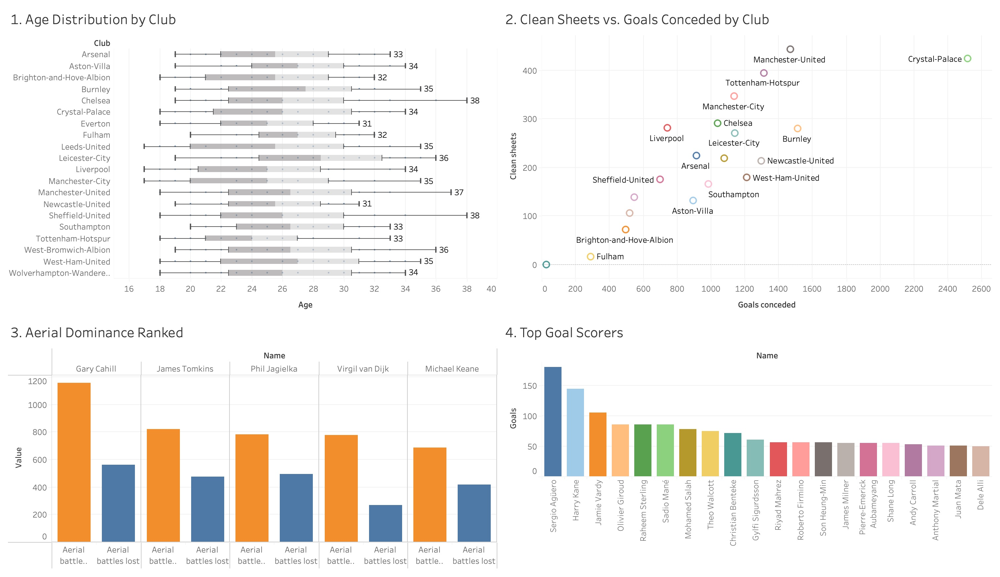
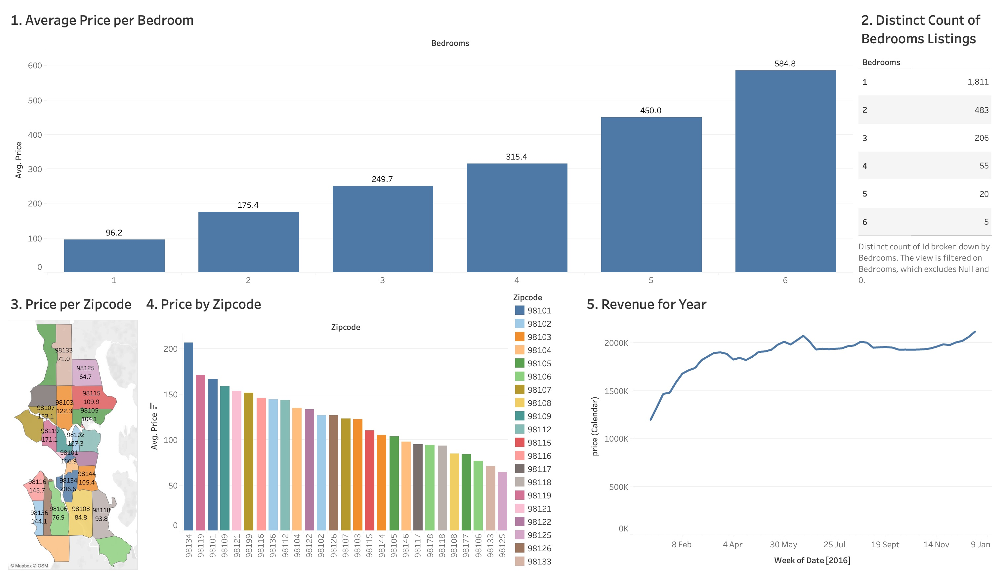

# Tableau Projects

This folder contains the visualisations from my data analytics projects using Tableau. Each project focuses on providing insights through interactive dashboards and data visualisation. For a detailed description of each project please visit the Tableau section of my website by pressing [here](https://nirosan-v.github.io/-NirosanVijayakumar.github.io/tableau.html).

## Projects

### [Airbnb Dashboard](https://public.tableau.com/views/AirBnBDashboard_17296341040640/Dashboard1?:language=en-GB&:sid=&:redirect=auth&:display_count=n&:origin=viz_share_link)
  
Analysis of Airbnb listings, including metrics on pricing, location, and reviews.

### [Premier League Dashboard](https://public.tableau.com/views/PremierLeagueData_17296357148740/Dashboard1?:language=en-GB&:sid=&:redirect=auth&:display_count=n&:origin=viz_share_link)
  
Visualisation of Premier League statistics, covering teams' performance, player metrics, and season highlights.

---

For more interactive dashboards, visit my full Tableau profile: [Nirosan Vijayakumar Tableau Profile](https://public.tableau.com/app/profile/nirosan.vijayakumar/vizzes)
